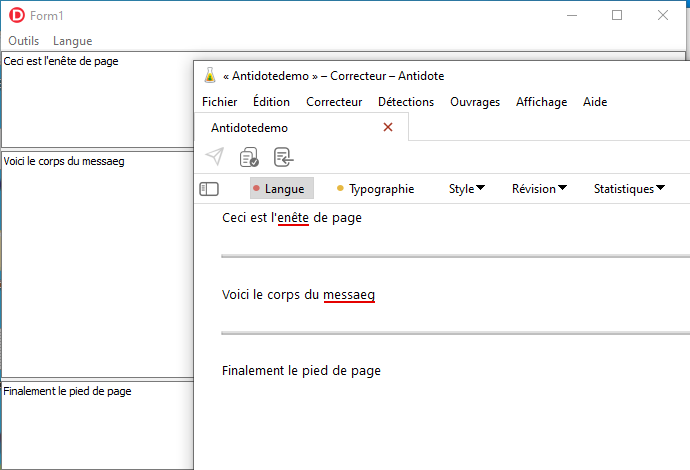

# AntidoteSDK
Antidote 11 SDK translation for Delphi

Exemple d'utilisation de [Antidote](https://www.antidote.info/fr) sous Delphi

Execute.AntidoteAPI.pas est la déclaration de l'API au plus bas niveau.

Execute.Antidote.pas est un composant VCL pout utiliser l'API.

